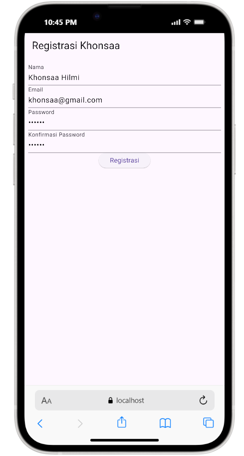
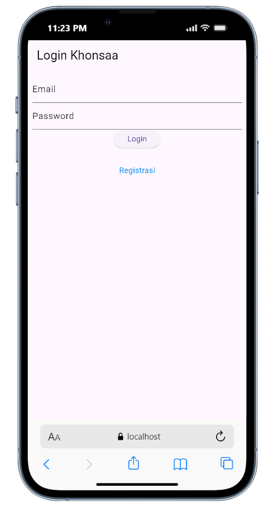
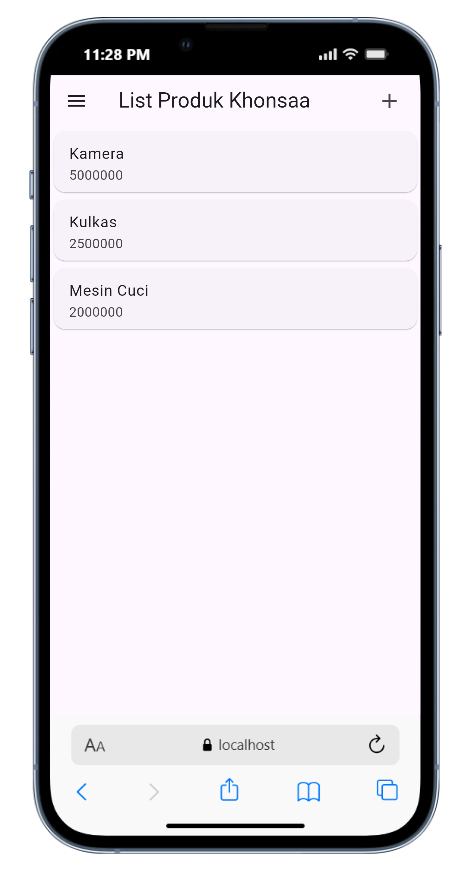
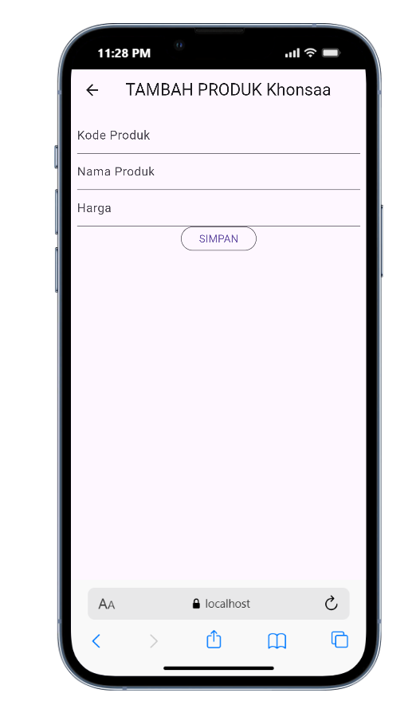
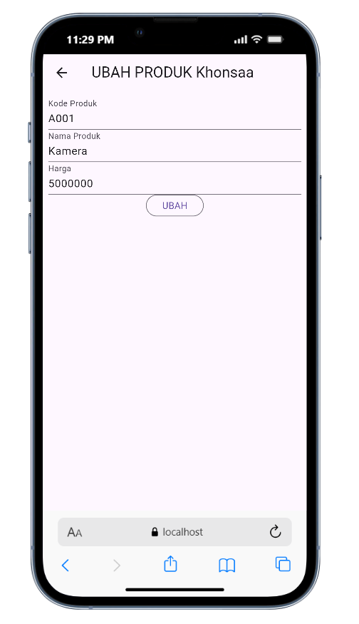

# Toko Kita - Aplikasi Flutter dengan REST API

## Identitas Mahasiswa
- **Nama**: Khonsaa
- **NIM**: 69
- **Shift Awal**: A
- **Shift Akhir**: D

---

## Daftar Isi
1. [Halaman Registrasi](#1-halaman-registrasi)
2. [Halaman Login](#2-halaman-login)
3. [Halaman List Produk](#3-halaman-list-produk)
4. [Halaman Form Produk (Tambah)](#4-halaman-form-produk-tambah)
5. [Halaman Detail Produk](#5-halaman-detail-produk)
6. [Halaman Form Produk (Edit)](#6-halaman-form-produk-edit)

---

## 1. Halaman Registrasi

### Screenshot


### Penjelasan Kode
File: `lib/ui/registrasi_page.dart`

Halaman registrasi adalah halaman pertama yang memungkinkan user baru untuk mendaftar ke dalam aplikasi Toko Kita.

#### Komponen Utama:

**1. Form Key untuk Validasi**
```dart
final _formKey = GlobalKey<FormState>();
```
- Digunakan untuk mengelola state form dan melakukan validasi

**2. Loading State**
```dart
bool _isLoading = false;
```
- Untuk menampilkan indikator loading saat proses registrasi

**3. Text Controllers**
```dart
final _namaTextboxController = TextEditingController();
final _emailTextboxController = TextEditingController();
final _passwordTextboxController = TextEditingController();
```
- Mengelola input dari user untuk setiap field

**4. Widget Nama TextField**
```dart
Widget _namaTextField() {
  return TextFormField(
    decoration: const InputDecoration(labelText: "Nama"),
    keyboardType: TextInputType.text,
    controller: _namaTextboxController,
    validator: (value) {
      if (value!.length < 3) {
        return "Nama harus diisi minimal 3 karakter";
      }
      return null;
    },
  );
}
```
- Input untuk nama user dengan validasi minimal 3 karakter

**5. Widget Email TextField**
```dart
Widget _emailTextField() {
  return TextFormField(
    decoration: const InputDecoration(labelText: "Email"),
    keyboardType: TextInputType.emailAddress,
    controller: _emailTextboxController,
    validator: (value) {
      if (value!.isEmpty) {
        return 'Email harus diisi';
      }
      Pattern pattern = r'^(([^<>()[\]\\.,;:\s@\"]+(\.[^<>()[\]\\.,;:\s@\"]+)*)|(\".+\"))@((\[[0-9]{1,3}\.[0-9]{1,3}\.[0-9]{1,3}\.[0-9]{1,3}\])|(([a-zA-Z\-0-9]+\.)+[a-zA-Z]{2,}))$';
      RegExp regex = RegExp(pattern.toString());
      if (!regex.hasMatch(value)) {
        return "Email tidak valid";
      }
      return null;
    },
  );
}
```
- Input email dengan validasi format email yang benar menggunakan RegEx

**6. Widget Password TextField**
```dart
Widget _passwordTextField() {
  return TextFormField(
    decoration: const InputDecoration(labelText: "Password"),
    keyboardType: TextInputType.text,
    obscureText: true,
    controller: _passwordTextboxController,
    validator: (value) {
      if (value!.length < 6) {
        return "Password harus diisi minimal 6 karakter";
      }
      return null;
    },
  );
}
```
- Input password dengan validasi minimal 6 karakter dan text tersembunyi (obscureText: true)

**7. Widget Konfirmasi Password**
```dart
Widget _passwordKonfirmasiTextField() {
  return TextFormField(
    decoration: const InputDecoration(labelText: "Konfirmasi Password"),
    keyboardType: TextInputType.text,
    obscureText: true,
    validator: (value) {
      if (value != _passwordTextboxController.text) {
        return "Konfirmasi Password tidak sama";
      }
      return null;
    },
  );
}
```
- Validasi konfirmasi password harus sama dengan password yang diinput

**8. Button Registrasi**
```dart
Widget _buttonRegistrasi() {
  return ElevatedButton(
    child: const Text("Registrasi"),
    onPressed: () {
      var validate = _formKey.currentState!.validate();
      // Proses registrasi akan ditambahkan di sini
    }
  );
}
```
- Tombol untuk submit form registrasi dengan validasi otomatis

---

## 2. Halaman Login

### Screenshot


### Penjelasan Kode
File: `lib/ui/login_page.dart`

Halaman login memungkinkan user yang sudah terdaftar untuk masuk ke aplikasi.

#### Komponen Utama:

**1. Form Key dan Controllers**
```dart
final _formKey = GlobalKey<FormState>();
bool _isLoading = false;
final _emailTextboxController = TextEditingController();
final _passwordTextboxController = TextEditingController();
```
- Sama seperti registrasi, menggunakan form key untuk validasi

**2. Widget Email TextField**
```dart
Widget _emailTextField() {
  return TextFormField(
    decoration: const InputDecoration(labelText: "Email"),
    keyboardType: TextInputType.emailAddress,
    controller: _emailTextboxController,
    validator: (value) {
      if (value!.isEmpty) {
        return 'Email harus diisi';
      }
      return null;
    },
  );
}
```
- Input email dengan validasi tidak boleh kosong

**3. Widget Password TextField**
```dart
Widget _passwordTextField() {
  return TextFormField(
    decoration: const InputDecoration(labelText: "Password"),
    keyboardType: TextInputType.text,
    obscureText: true,
    controller: _passwordTextboxController,
    validator: (value) {
      if (value!.isEmpty) {
        return "Password harus diisi";
      }
      return null;
    },
  );
}
```
- Input password dengan validasi tidak boleh kosong

**4. Button Login**
```dart
Widget _buttonLogin() {
  return ElevatedButton(
    child: const Text("Login"),
    onPressed: () {
      var validate = _formKey.currentState!.validate();
      // Proses login akan ditambahkan di sini
    }
  );
}
```
- Tombol submit untuk proses login

**5. Menu Registrasi**
```dart
Widget _menuRegistrasi() {
  return Center(
    child: InkWell(
      child: const Text(
        "Registrasi",
        style: TextStyle(color: Colors.blue),
      ),
      onTap: () {
        Navigator.push(
          context,
          MaterialPageRoute(builder: (context) => const RegistrasiPage())
        );
      },
    ),
  );
}
```
- Link untuk menuju halaman registrasi bagi user yang belum punya akun

---

## 3. Halaman List Produk

### Screenshot


### Penjelasan Kode
File: `lib/ui/produk_page.dart`

Halaman ini menampilkan daftar semua produk yang tersedia di toko.

#### Komponen Utama:

**1. AppBar dengan Tombol Tambah**
```dart
appBar: AppBar(
  title: const Text('List Produk'),
  actions: [
    Padding(
      padding: const EdgeInsets.only(right: 20.0),
      child: GestureDetector(
        child: const Icon(Icons.add, size: 26.0),
        onTap: () async {
          Navigator.push(
            context,
            MaterialPageRoute(builder: (context) => ProdukForm())
          );
        },
      )
    )
  ],
),
```
- AppBar dengan icon tambah di kanan atas untuk menambah produk baru

**2. Drawer Menu**
```dart
drawer: Drawer(
  child: ListView(
    children: [
      ListTile(
        title: const Text('Logout'),
        trailing: const Icon(Icons.logout),
        onTap: () async {
          // Proses logout akan ditambahkan di sini
        },
      )
    ],
  ),
),
```
- Side drawer menu yang berisi opsi logout

**3. ListView Produk**
```dart
body: ListView(
  children: [
    ItemProduk(
      produk: Produk(
        id: 1,
        kodeProduk: 'A001',
        namaProduk: 'Kamera',
        hargaProduk: 5000000,
      ),
    ),
    ItemProduk(
      produk: Produk(
        id: 2,
        kodeProduk: 'A002',
        namaProduk: 'Kulkas',
        hargaProduk: 2500000,
      ),
    ),
    // ... produk lainnya
  ],
),
```
- Daftar produk ditampilkan menggunakan ListView dengan data dummy (nantinya akan diganti dengan data dari API)

**4. Widget Item Produk**
```dart
class ItemProduk extends StatelessWidget {
  final Produk produk;
  const ItemProduk({Key? key, required this.produk}) : super(key: key);

  @override
  Widget build(BuildContext context) {
    return GestureDetector(
      onTap: () {
        Navigator.push(
          context,
          MaterialPageRoute(
            builder: (context) => ProdukDetail(produk: produk)
          )
        );
      },
      child: Card(
        child: ListTile(
          title: Text(produk.namaProduk!),
          subtitle: Text(produk.hargaProduk.toString()),
        ),
      ),
    );
  }
}
```
- Setiap item produk ditampilkan dalam Card dengan ListTile
- Ketika di-tap akan navigasi ke halaman detail produk

---

## 4. Halaman Form Produk (Tambah)

### Screenshot


### Penjelasan Kode
File: `lib/ui/produk_form.dart`

Form ini digunakan untuk menambah produk baru atau edit produk yang sudah ada.

#### Komponen Utama:

**1. Variabel State**
```dart
final _formKey = GlobalKey<FormState>();
bool _isLoading = false;
String judul = "TAMBAH PRODUK";
String tombolSubmit = "SIMPAN";
final _kodeProdukTextboxController = TextEditingController();
final _namaProdukTextboxController = TextEditingController();
final _hargaProdukTextboxController = TextEditingController();
```
- Controllers untuk mengelola input form
- Variabel judul dan tombolSubmit dinamis tergantung mode (tambah/edit)

**2. Method isUpdate**
```dart
isUpdate() {
  if (widget.produk != null) {
    setState(() {
      judul = "UBAH PRODUK";
      tombolSubmit = "UBAH";
      _kodeProdukTextboxController.text = widget.produk!.kodeProduk!;
      _namaProdukTextboxController.text = widget.produk!.namaProduk!;
      _hargaProdukTextboxController.text = widget.produk!.hargaProduk.toString();
    });
  } else {
    judul = "TAMBAH PRODUK";
    tombolSubmit = "SIMPAN";
  }
}
```
- Mengecek apakah form dalam mode tambah atau edit
- Jika edit, field akan diisi dengan data produk yang akan diubah

**3. Widget Kode Produk TextField**
```dart
Widget _kodeProdukTextField() {
  return TextFormField(
    decoration: const InputDecoration(labelText: "Kode Produk"),
    keyboardType: TextInputType.text,
    controller: _kodeProdukTextboxController,
    validator: (value) {
      if (value!.isEmpty) {
        return "Kode Produk harus diisi";
      }
      return null;
    },
  );
}
```
- Input kode produk dengan validasi tidak boleh kosong

**4. Widget Nama Produk TextField**
```dart
Widget _namaProdukTextField() {
  return TextFormField(
    decoration: const InputDecoration(labelText: "Nama Produk"),
    keyboardType: TextInputType.text,
    controller: _namaProdukTextboxController,
    validator: (value) {
      if (value!.isEmpty) {
        return "Nama Produk harus diisi";
      }
      return null;
    },
  );
}
```
- Input nama produk dengan validasi tidak boleh kosong

**5. Widget Harga Produk TextField**
```dart
Widget _hargaProdukTextField() {
  return TextFormField(
    decoration: const InputDecoration(labelText: "Harga"),
    keyboardType: TextInputType.number,
    controller: _hargaProdukTextboxController,
    validator: (value) {
      if (value!.isEmpty) {
        return "Harga harus diisi";
      }
      return null;
    },
  );
}
```
- Input harga dengan keyboard tipe number

**6. Button Submit**
```dart
Widget _buttonSubmit() {
  return OutlinedButton(
    child: Text(tombolSubmit),
    onPressed: () {
      var validate = _formKey.currentState!.validate();
      // Proses simpan/update akan ditambahkan di sini
    }
  );
}
```
- Tombol dinamis (SIMPAN atau UBAH) tergantung mode form

---

## 5. Halaman Detail Produk

### Screenshot


### Penjelasan Kode
File: `lib/ui/produk_detail.dart`

Halaman ini menampilkan detail lengkap dari produk yang dipilih beserta tombol edit dan delete.

#### Komponen Utama:

**1. Tampilan Detail Produk**
```dart
body: Center(
  child: Column(
    children: [
      Text(
        "Kode : ${widget.produk!.kodeProduk}",
        style: const TextStyle(fontSize: 20.0),
      ),
      Text(
        "Nama : ${widget.produk!.namaProduk}",
        style: const TextStyle(fontSize: 18.0),
      ),
      Text(
        "Harga : Rp. ${widget.produk!.hargaProduk.toString()}",
        style: const TextStyle(fontSize: 18.0),
      ),
      _tombolHapusEdit()
    ],
  ),
),
```
- Menampilkan kode, nama, dan harga produk

**2. Widget Tombol Edit dan Delete**
```dart
Widget _tombolHapusEdit() {
  return Row(
    mainAxisSize: MainAxisSize.min,
    children: [
      // Tombol Edit
      OutlinedButton(
        child: const Text("EDIT"),
        onPressed: () {
          Navigator.push(
            context,
            MaterialPageRoute(
              builder: (context) => ProdukForm(produk: widget.produk!),
            ),
          );
        },
      ),
      // Tombol Hapus
      OutlinedButton(
        child: const Text("DELETE"),
        onPressed: () => confirmHapus(),
      ),
    ],
  );
}
```
- Tombol EDIT untuk menuju form edit produk
- Tombol DELETE untuk menghapus produk dengan konfirmasi

**3. Konfirmasi Hapus**
```dart
void confirmHapus() {
  AlertDialog alertDialog = AlertDialog(
    content: const Text("Yakin ingin menghapus data ini?"),
    actions: [
      OutlinedButton(
        child: const Text("Ya"),
        onPressed: () {
          // Proses hapus akan ditambahkan di sini
        },
      ),
      OutlinedButton(
        child: const Text("Batal"),
        onPressed: () => Navigator.pop(context),
      )
    ],
  );
  showDialog(builder: (context) => alertDialog, context: context);
}
```
- Dialog konfirmasi sebelum menghapus produk
- User bisa memilih "Ya" untuk konfirmasi atau "Batal" untuk membatalkan

---

## 6. Halaman Form Produk (Edit)

### Screenshot


### Penjelasan Kode
File: `lib/ui/produk_form.dart` (sama dengan form tambah)

Halaman ini menggunakan komponen yang sama dengan form tambah produk, namun dengan perbedaan:

#### Perbedaan dengan Form Tambah:

**1. Judul dan Tombol**
- Judul berubah menjadi "UBAH PRODUK"
- Tombol berubah menjadi "UBAH"

**2. Field Terisi Otomatis**
```dart
_kodeProdukTextboxController.text = widget.produk!.kodeProduk!;
_namaProdukTextboxController.text = widget.produk!.namaProduk!;
_hargaProdukTextboxController.text = widget.produk!.hargaProduk.toString();
```
- Semua field otomatis terisi dengan data produk yang akan diubah
- User tinggal mengubah field yang ingin diubah

**3. Proses Submit**
- Ketika tombol UBAH ditekan, akan melakukan update data ke API
- Setelah berhasil, kembali ke halaman detail atau list produk

---

## Model Classes

### 1. Model Login
File: `lib/model/login.dart`

```dart
class Login {
  int? code;
  bool? status;
  String? token;
  int? userID;
  String? userEmail;

  Login({this.code, this.status, this.token, this.userID, this.userEmail});

  factory Login.fromJson(Map<String, dynamic> obj) {
    if (obj['code'] == 200) {
      return Login(
        code: obj['code'],
        status: obj['status'],
        token: obj['data']['token'],
        userID: int.parse(obj['data']['user']['id']),
        userEmail: obj['data']['user']['email']
      );
    } else {
      return Login(
        code: obj['code'],
        status: obj['status'],
      );
    }
  }
}
```
- Mengkonversi JSON response dari API login menjadi object Login

### 2. Model Registrasi
File: `lib/model/registrasi.dart`

```dart
class Registrasi {
  int? code;
  bool? status;
  String? data;

  Registrasi({this.code, this.status, this.data});

  factory Registrasi.fromJson(Map<String, dynamic> obj) {
    return Registrasi(
      code: obj['code'], 
      status: obj['status'], 
      data: obj['data']
    );
  }
}
```
- Mengkonversi JSON response dari API registrasi menjadi object Registrasi

### 3. Model Produk
File: `lib/model/produk.dart`

```dart
class Produk {
  String? id;
  String? kodeProduk;
  String? namaProduk;
  var hargaProduk;

  Produk({this.id, this.kodeProduk, this.namaProduk, this.hargaProduk});

  factory Produk.fromJson(Map<String, dynamic> obj) {
    return Produk(
      id: obj['id'],
      kodeProduk: obj['kode_produk'],
      namaProduk: obj['nama_produk'],
      hargaProduk: obj['harga']
    );
  }
}
```
- Mengkonversi JSON response dari API produk menjadi object Produk

---

## Struktur Folder Projek

```
lib/
├── main.dart
├── model/
│   ├── login.dart
│   ├── registrasi.dart
│   └── produk.dart
└── ui/
    ├── login_page.dart
    ├── registrasi_page.dart
    ├── produk_page.dart
    ├── produk_form.dart
    └── produk_detail.dart

assets/
└── screenshots/
    ├── registrasi.png
    ├── login.png
    ├── list_produk.png
    ├── form_tambah_produk.png
    ├── detail_produk.png
    └── form_edit_produk.png
```

---

## API Endpoints yang Digunakan

1. **POST** `/registrasi` - Mendaftarkan user baru
2. **POST** `/login` - Login user
3. **GET** `/produk` - Mengambil semua data produk
4. **POST** `/produk` - Menambah produk baru
5. **GET** `/produk/{id}` - Mengambil detail produk
6. **PUT** `/produk/{id}` - Mengubah data produk
7. **DELETE** `/produk/{id}` - Menghapus produk

---

## Cara Menjalankan Aplikasi

1. Pastikan Flutter SDK sudah terinstall
2. Clone repository ini
3. Jalankan `flutter pub get` untuk install dependencies
4. Jalankan XAMPP (Apache dan MySQL)
5. Setup database dan REST API CodeIgniter sesuai modul
6. Jalankan aplikasi dengan:
   ```bash
   flutter run -d web-server --web-port=8080
   ```
7. Buka Chrome di `http://localhost:8080`

---

## Fitur Aplikasi

Registrasi user baru  
Login user  
Menampilkan list produk  
Menambah produk baru  
Melihat detail produk  
Mengubah data produk  
Menghapus produk  
Logout  

---

## Teknologi yang Digunakan

- **Frontend**: Flutter
- **Backend**: CodeIgniter 4 REST API
- **Database**: MySQL
- **Web Server**: XAMPP (Apache + MySQL)
- **API Testing**: Postman

---

**Dibuat oleh: Khonsaa (NIM: 69)**  
**Shift: A - D**